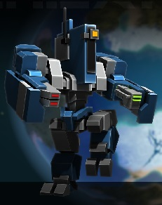

## Ivan Bobrik

### Contact information:
* Phone: +375333437591
* E-mail: ivan52945@gmail.com
* Discord: Nemicus#3117
### About myself:
I have good interpersonal skills, work well in a team and really want to learn new skills.
### Skills:
* C++ Basics
* Git
* VS Code
### Code example:
```
int sum(int a, int b){
  return a + b;  
}
```
### Education
* Belarusian State University of Informatics and Radioelectronics
### English
    A2